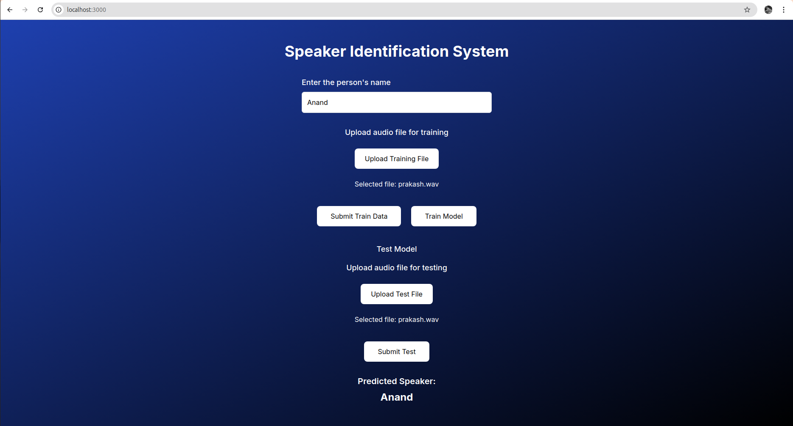

# About the application

This is a full stack application which uses machinne learning and AI algorithms to perform speaker identification.

How to run the code.

```bash
git clone https://github.com/AnandPTi/Speaker-Verification-System.git
```

Next create virtual envicornment and set up the environement for the backend.

```bash
cd backend/
virtualenv .venv
source .venv/bin/activate
pip install -r requirements.txt
```

Open another terminal and run the recorder files to record the audio files.

Next set up the front end.

```
cd frontend/
bun install
bun run dev
```

